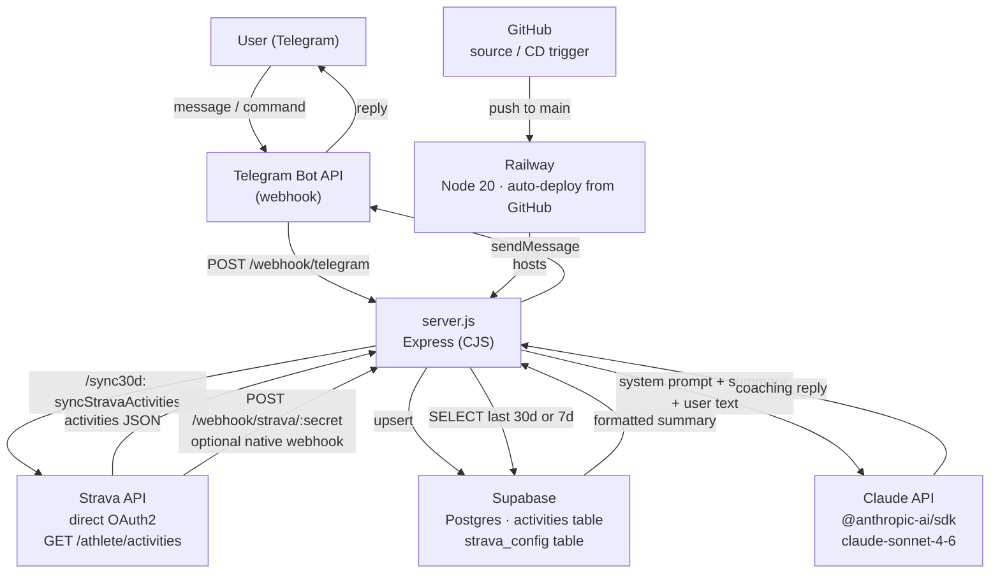

# TrailCoach (Sisu Coach)

Personal AI trail-running coach for Denis Shuvalov. Responds in Russian via Telegram, pulls training data from Strava, stores in Supabase, generates advice with Claude.

## Architecture



## Data flow (on each Telegram message)

1. Telegram → `POST /webhook/telegram` (verified via `X-Telegram-Bot-Api-Secret-Token`)
2. Route command:
   - `/sync30d` → `syncStravaActivities()` — fetch last 30 days from Strava → upsert Supabase
   - `/feedback` → `getFeedbackResponse()` — Claude analysis of last 7 days
   - `/plan` → `getPlanResponse()` — Claude training plan for next week
   - anything else → `getCoachingResponse(text)` — reads Supabase, calls Claude
3. Query Supabase `activities` with flat JSON field extractions (PostgREST `->>`), format as text summary
4. Call Claude with system prompt = static `FORMATTING_RULES` (in code) + `users.profile_text` fetched from Supabase (athlete profile, zones, plan) + summary
5. Send Claude reply back to Telegram via `fetch` (native Node, no telegram npm package)

## Telegram commands

| Command | Handler | Data window | max_tokens |
|---|---|---|---|
| `/sync30d` | `syncStravaActivities()` | — | — |
| `/feedback` | `getFeedbackResponse()` | 7 days | 800 |
| `/plan` | `getPlanResponse()` | 30 days | 1000 |
| _(free text)_ | `getCoachingResponse()` | 30 days | 500 |

## Dependencies

| Package | Role |
|---|---|
| `express` | HTTP server, webhook routing |
| `dotenv` | Load `.env` vars at startup |
| `@anthropic-ai/sdk` | Claude API client |
| `@supabase/supabase-js` | Supabase DB client |
| Node built-in `fetch` | Strava API + Telegram Bot API calls |

## Environment variables

| Variable | Description |
|---|---|
| `SUPABASE_URL` | Supabase project URL |
| `SUPABASE_SERVICE_KEY` | Supabase service role key |
| `ANTHROPIC_API_KEY` | Anthropic API key |
| `TELEGRAM_BOT_TOKEN` | Telegram bot token |
| `TELEGRAM_WEBHOOK_SECRET` | Secret for `X-Telegram-Bot-Api-Secret-Token` header |
| `COMPOSIO_WEBHOOK_SECRET` | Secret path segment for Strava webhook URL |
| `STRAVA_CLIENT_SECRET` | Strava app client secret (OAuth2) |
| `PORT` | Server port (Railway sets this automatically) |

## Endpoints

| Method | Path | Description |
|---|---|---|
| `POST` | `/webhook/telegram` | Telegram message delivery |
| `POST` | `/webhook/strava/:secret` | Strava native webhook (optional) |
| `GET` | `/webhook/strava/:secret` | Strava subscription validation challenge |
| `GET` | `/health` | Health check |
| `GET` | `/setup/strava-oauth` | Start Strava OAuth2 flow (one-time) |
| `GET` | `/setup/strava-callback` | Strava OAuth2 callback; stores tokens |
| `GET` | `/setup/strava-webhook` | Register Strava push subscription (one-time) |

## Key notes

- **No Composio**: Strava access is direct OAuth2. Tokens stored in `strava_tokens` (per user). Legacy `strava_config` (id=1) kept only as fallback for Strava native webhook context. Auto-refresh if expiry within 5 min.
- **Strava account**: Denis Shuvalov, athlete id: 46894875, Strava app client_id: 233959, telegram_chat_id: 8358078346.
- **Pull model**: Strava data is fetched on demand via `/sync30d` command. Native webhook at `/webhook/strava/:secret` is optional for real-time ingestion.
- **Supabase select**: `activities` query reads full `raw` JSONB column; `formatActivities()` accesses fields via `a.raw?.field`.
- **System prompt**: static `FORMATTING_RULES` (in `server.js`) + per-user `users.profile_text` from Supabase. Combined by `getSystemPrompt(chatId)`, cached per chatId in a `Map` (no cross-user cache pollution).
- **Multi-user**: `findOrCreateUser(chatId)` resolves user on every Telegram message. `is_active` flag gates access. All activity queries filtered by `user_id`. Strava functions take `userId` (uuid from `users` table).
- **Deployment**: Railway auto-deploys on push to `main` in GitHub. Node ≥ 20 required.

## Database schema

```sql
-- Multi-user identity
CREATE TABLE users (
  id                uuid PRIMARY KEY DEFAULT gen_random_uuid(),
  telegram_chat_id  bigint UNIQUE NOT NULL,
  strava_athlete_id bigint UNIQUE,
  name              text,
  profile_text      text,   -- athlete profile, zones, plan, principles (user-specific part of system prompt)
  is_active         boolean DEFAULT true,
  created_at        timestamptz DEFAULT now()
);

-- Strava OAuth2 tokens per user
CREATE TABLE strava_tokens (
  user_id       uuid PRIMARY KEY REFERENCES users(id) ON DELETE CASCADE,
  access_token  text NOT NULL,
  refresh_token text NOT NULL,
  expires_at    bigint NOT NULL
);

-- Training activities (one per Strava activity)
CREATE TABLE activities (
  id            bigserial PRIMARY KEY,
  strava_id     bigint UNIQUE NOT NULL,
  user_id       uuid REFERENCES users(id) ON DELETE CASCADE,
  type          text,
  distance_m    float8,
  moving_time_s int,
  started_at    timestamptz,
  raw           jsonb    -- full Strava activity object
);
-- Indexes: activities(user_id, started_at DESC)

-- Legacy single-user token store (still used by server.js)
CREATE TABLE strava_config (
  id            int PRIMARY KEY,
  access_token  text,
  refresh_token text,
  expires_at    bigint
);
```
