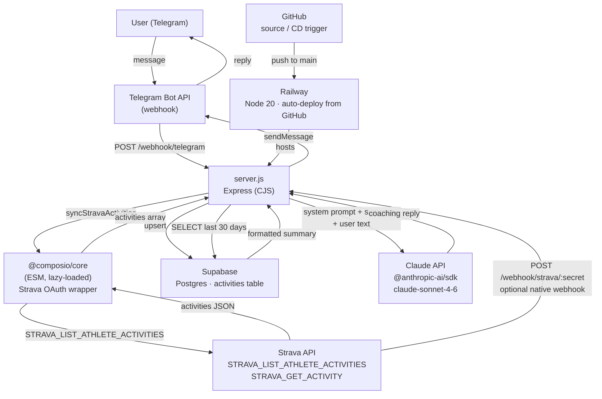

# TrailCoach (Sisu Coach)

Personal AI trail-running coach for Denis Shuvalov. Responds in Russian via Telegram, pulls training data from Strava, stores in Supabase, generates advice with Claude.

## Architecture

## Data flow (on each Telegram message)

1. Telegram → `POST /webhook/telegram` (verified via `X-Telegram-Bot-Api-Secret-Token`)
2. `syncStravaActivities()` — Composio fetches last 30 days from Strava → upsert to Supabase
3. Query Supabase `activities` for last 30 days, format as text summary
4. Call Claude with `SYSTEM_PROMPT` (athlete profile + zones + plan) + summary + user question
5. Send Claude reply back to Telegram via `fetch` (native Node, no npm package)

## Dependencies

| Package | Role |
|---|---|
| `express` | HTTP server, webhook routing |
| `dotenv` | Load `.env` vars at startup |
| `@anthropic-ai/sdk` | Claude API client |
| `@composio/core` | Strava OAuth + tool calls (ESM — lazy-loaded via `import()` for CJS compat) |
| `@supabase/supabase-js` | Supabase DB client |
| Node built-in `fetch` | Telegram Bot API calls (no telegram npm package) |

## Environment variables

| Variable | Description |
|---|---|
| `SUPABASE_URL` | Supabase project URL |
| `SUPABASE_SERVICE_KEY` | Supabase service role key |
| `ANTHROPIC_API_KEY` | Anthropic API key |
| `COMPOSIO_API_KEY` | Composio API key |
| `TELEGRAM_BOT_TOKEN` | Telegram bot token |
| `TELEGRAM_WEBHOOK_SECRET` | Secret for `X-Telegram-Bot-Api-Secret-Token` header |
| `COMPOSIO_WEBHOOK_SECRET` | Secret path segment for Strava webhook URL |
| `PORT` | Server port (Railway sets this automatically) |

## Endpoints

| Method | Path | Description |
|---|---|---|
| `POST` | `/webhook/telegram` | Telegram message delivery |
| `POST` | `/webhook/strava/:secret` | Strava native webhook (optional) |
| `GET` | `/webhook/strava/:secret` | Strava subscription validation challenge |
| `GET` | `/health` | Health check |

## Key notes

- **CJS/ESM compat**: `server.js` is CommonJS. `@composio/core` is ESM-only — loaded via `async import()` and cached in `_composio`.
- **No Strava webhook required**: `syncStravaActivities()` runs on every Telegram message (pull model). Native webhook at `/webhook/strava/:secret` is optional for real-time ingestion.
- **Composio account**: `strava_melano-rusher` (Denis Shuvalov, Strava id: 46894875)
- **Deployment**: Railway auto-deploys on push to `main` in GitHub. Node ≥ 20 required.
