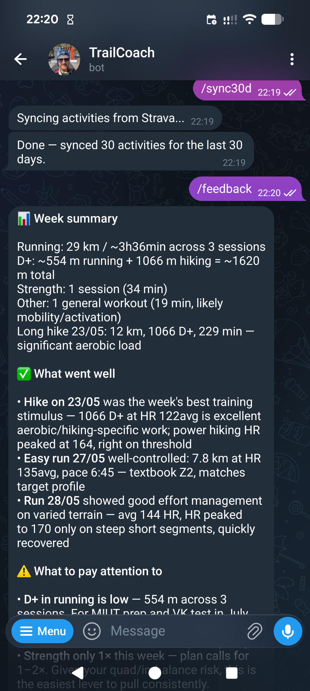
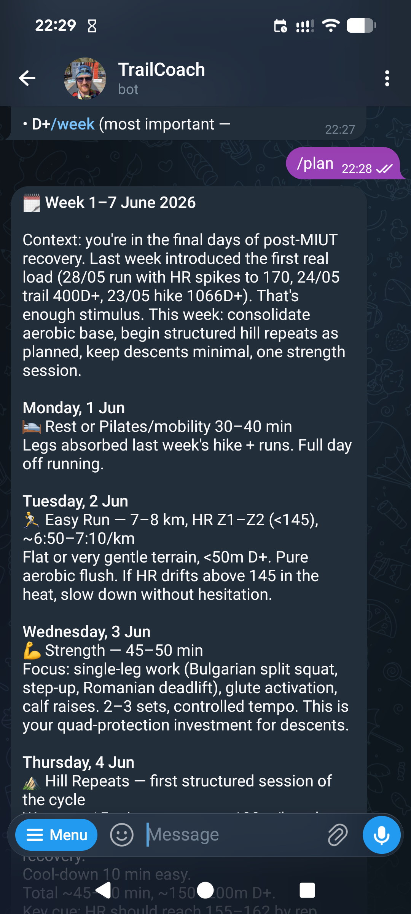
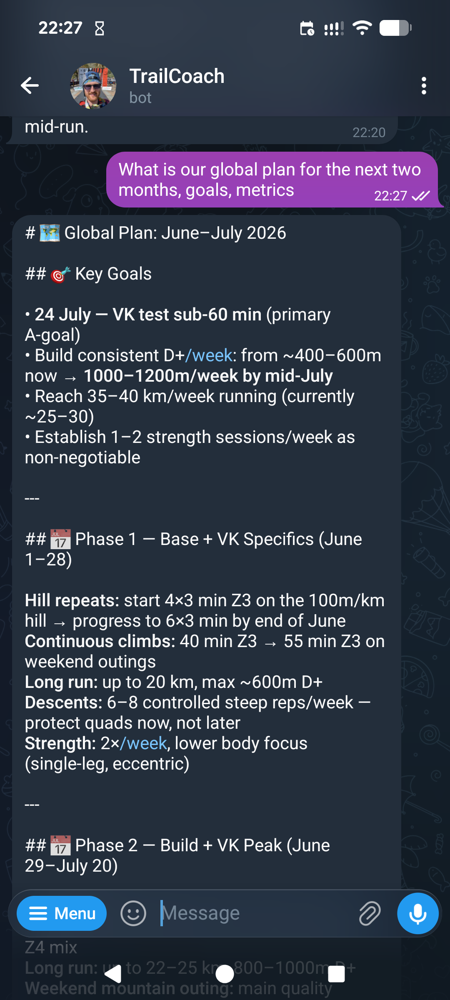

# TrailCoach (Sisu Coach)

A personal AI trail-running coach that connects Telegram, Strava, and Claude to deliver data-driven training advice.

## How it works

A user sends a message or command in Telegram. The bot loads their recent Strava activities from Supabase, builds a structured summary, and passes it to Claude along with the athlete's profile. Claude returns coaching advice which is sent back to the user.

```
Telegram → Express (Azure Container Apps) → Supabase → Claude API
                          ↑
                      Strava API
```

On `/sync30d` the server fetches the last 30 detailed activities from Strava and upserts them into Supabase. All subsequent coaching queries read from Supabase — no live Strava calls.

## Demo

<p align="center">
  
  
  
</p>
<p align="center">
  <em>Weekly feedback &nbsp;·&nbsp; Training plan &nbsp;·&nbsp; Free-form coaching</em>
</p>

## Stack

| Technology | Role |
|---|---|
| Node.js + Express | HTTP server, webhook routing |
| Supabase (Postgres) | Activity storage, user profiles, Strava tokens |
| Claude API (`claude-sonnet-4-6`) | Coaching response generation |
| Strava API | Training data source (OAuth2, pull + webhook) |
| Telegram Bot API | User interface |
| Docker | Containerisation (`node:20-alpine`) |
| Azure Container Apps | Hosting (Italy North) |

## Environment variables

| Variable | Description |
|---|---|
| `SUPABASE_URL` | Supabase project URL |
| `SUPABASE_SERVICE_KEY` | Supabase service role key |
| `ANTHROPIC_API_KEY` | Anthropic API key |
| `TELEGRAM_BOT_TOKEN` | Telegram bot token |
| `TELEGRAM_WEBHOOK_SECRET` | Validates incoming Telegram webhook requests |
| `COMPOSIO_WEBHOOK_SECRET` | Secret path segment in Strava webhook URL; also gates `/setup/*` endpoints |
| `STRAVA_CLIENT_SECRET` | Strava OAuth2 app secret |
| `APP_BASE_URL` | Public base URL of the deployed app (e.g. `https://your-app.italynorth.azurecontainerapps.io`) |
| `PORT` | Server port — set automatically by Azure |

## Deploy to Azure

Prerequisites: Azure CLI installed, Docker running, logged in with `az login`.

**First deploy (one-time infrastructure setup)**

1. Create resource group and Container Registry:
   ```
   az group create --name trailcoach-rg --location italynorth
   az acr create --name trailcoachreg --resource-group trailcoach-rg --sku Basic --admin-enabled true
   ```

2. Create the Container Apps environment:
   ```
   az containerapp env create --name trailcoach-env --resource-group trailcoach-rg --location italynorth
   ```

3. Build and push the image, then create the app:
   ```
   az acr build --registry trailcoachreg --image trailcoach:latest .
   az containerapp create --name trailcoach-app --resource-group trailcoach-rg \
     --environment trailcoach-env --image trailcoachreg.azurecr.io/trailcoach:latest \
     --registry-server trailcoachreg.azurecr.io \
     --target-port 3000 --ingress external --min-replicas 1 --max-replicas 1
   ```

4. Set all environment variables in Azure Portal or via `az containerapp update --set-env-vars`.

5. Register the Telegram webhook:
   ```
   curl -X POST "https://api.telegram.org/bot<TOKEN>/setWebhook" \
     -d "url=<APP_BASE_URL>/webhook/telegram" \
     -d "secret_token=<TELEGRAM_WEBHOOK_SECRET>"
   ```

6. Register the Strava webhook (app must be running):
   ```
   GET <APP_BASE_URL>/setup/strava-webhook?token=<COMPOSIO_WEBHOOK_SECRET>
   ```

**Subsequent deploys**

```powershell
.\deploy-azure.ps1
```

The script builds the Docker image, pushes to ACR, updates the container app, and syncs env vars from `.env`.

## Adding a new user

**Automatic (via bot):**
1. User sends `/start` to the bot.
2. User sends `/connect` — bot sends a Strava OAuth link.
3. User authorises on Strava — tokens are saved to `strava_tokens`, `users.strava_athlete_id` is set.
4. User sends `/sync30d` to load activities.

**Manual (required before coaching works):**
- In Supabase, open the `users` table and fill in `profile_text` for the new user. This is the athlete-specific part of the system prompt: HR zones, current training plan, race goals, principles. Without it, coaching commands will fail.
- Optionally set `is_active = false` to block access before the profile is ready.

## Bot commands

| Command | Description | What happens |
|---|---|---|
| `/start` | Onboarding message | Static reply with command list |
| `/connect` | Connect Strava account | Sends OAuth2 link; on callback stores tokens and sets `strava_athlete_id` |
| `/sync30d` | Sync last 30 days from Strava | Fetches 30 detailed activities, upserts into Supabase |
| `/feedback` | Weekly training analysis | Claude analyses last 7 days of activities |
| `/plan` | Training plan for the week | Claude generates a day-by-day plan based on last 30 days |
| _(free text)_ | Coaching question | Claude answers using last 30 days of activity data |

Rate limit: 20 AI requests per user per day (resets at midnight UTC). `/sync30d` and `/connect` are not rate-limited.

## Monitoring

### Real-time (in-memory)

`GET /health` returns a full metrics snapshot alongside uptime and memory:

```json
{
  "ok": true,
  "uptime_s": 3600,
  "memory_mb": 64,
  "metrics": {
    "telegram": { "messages_total": 42, "messages_by_command": { "feedback": 10, ... }, "send_failures": 0 },
    "claude":   { "calls_total": 30, "errors_total": 0, "tokens_input": 45000, "tokens_output": 12000, "latency_p50_ms": 1800, "latency_p90_ms": 3200 },
    "strava":   { "syncs_total": 5, "sync_errors": 0, "webhook_events": 12, "token_refreshes": 1 },
    "supabase": { "errors_total": 0 },
    "ratelimit":{ "hits_total": 0 }
  }
}
```

Counters reset on container restart.

### Persistent (Supabase)

`flushMetrics()` upserts daily totals to `metrics_daily` every 3 hours and on `SIGTERM` (graceful shutdown). Each flush overwrites today's row with the current in-memory values — no SQL increments needed.

Before first deploy, create the table in the Supabase SQL editor:

```sql
CREATE TABLE IF NOT EXISTS metrics_daily (
  date               date PRIMARY KEY,
  telegram_messages  int DEFAULT 0,
  claude_calls       int DEFAULT 0,
  claude_errors      int DEFAULT 0,
  tokens_input       bigint DEFAULT 0,
  tokens_output      bigint DEFAULT 0,
  strava_syncs       int DEFAULT 0,
  strava_sync_errors int DEFAULT 0,
  strava_webhooks    int DEFAULT 0,
  supabase_errors    int DEFAULT 0,
  ratelimit_hits     int DEFAULT 0,
  updated_at         timestamptz DEFAULT now()
);
```

### Structured logs

Key events are logged with `key=value` pairs — searchable in Azure Container Apps log stream:

```
[claude] call command=feedback latency_ms=1240 tokens_in=850 tokens_out=620
[strava] sync user_id=<uuid> count=18 latency_ms=3400
[ratelimit] hit user_id=<uuid> command=feedback
[metrics] flushed to Supabase for 2026-06-01
```

### Admin alerts

Critical errors (Strava upsert failure, sync error, unhandled handler error) are sent as Telegram messages to the admin chat.

## Database

**users**
| Column | Type | Notes |
|---|---|---|
| id | uuid | Primary key |
| telegram_chat_id | bigint | Unique |
| strava_athlete_id | bigint | Set after OAuth |
| name | text | |
| profile_text | text | Athlete-specific system prompt content |
| is_active | boolean | Gates all bot access |
| created_at | timestamptz | |

**strava_tokens**
| Column | Type | Notes |
|---|---|---|
| user_id | uuid | FK → users |
| access_token | text | |
| refresh_token | text | |
| expires_at | bigint | Unix timestamp; auto-refreshed if within 5 min |

**activities**
| Column | Type | Notes |
|---|---|---|
| id | bigserial | Primary key |
| strava_id | bigint | Unique |
| user_id | uuid | FK → users |
| type | text | e.g. `TrailRun`, `WeightTraining` |
| distance_m | float8 | |
| moving_time_s | int | |
| started_at | timestamptz | Indexed with user_id |
| raw | jsonb | Full Strava activity object |

**metrics_daily**
| Column | Type | Notes |
|---|---|---|
| date | date | Primary key |
| telegram_messages | int | Total messages received |
| claude_calls | int | Total `messages.create()` calls |
| claude_errors | int | Claude API errors |
| tokens_input | bigint | Cumulative input tokens |
| tokens_output | bigint | Cumulative output tokens |
| strava_syncs | int | `/sync30d` invocations |
| strava_sync_errors | int | Failed syncs |
| strava_webhooks | int | Webhook events received |
| supabase_errors | int | Any Supabase call errors |
| ratelimit_hits | int | Rate limit rejections |
| updated_at | timestamptz | Last flush timestamp |
